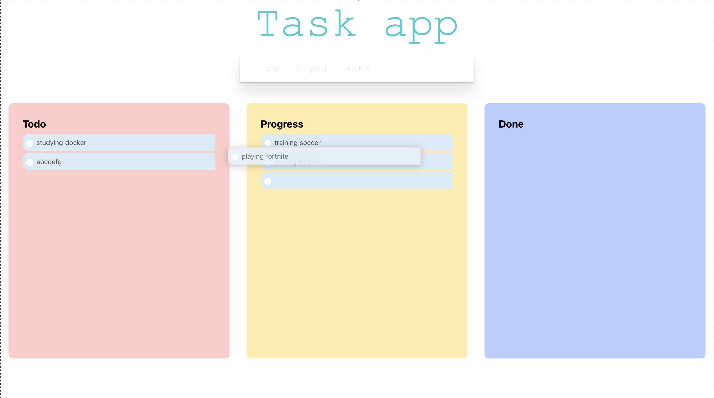

# rapsodier

this app is todo manager




```
$ docker-compose up -d
```

## ref

- [docker-compose init volume](https://qiita.com/furu8ma/items/75e5b1df29fef04ec7f1)
- [vuedraggable](https://github.com/SortableJS/Vue.Draggable)
